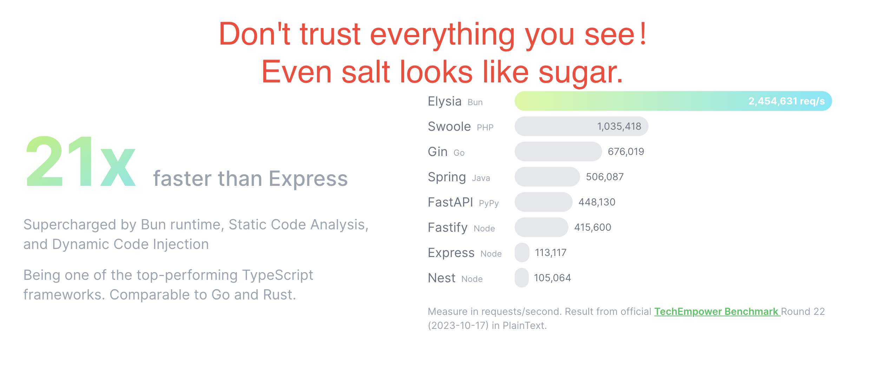

# benchmark elysia vs fastify



## bun

app/src/index.ts

```js
import { Elysia } from "elysia";

const app = new Elysia().get("/", () => "Hello Elysia").listen(3000);

console.log(
  `🦊 Elysia is running at ${app.server?.hostname}:${app.server?.port}`
);

```

compile to single file and run.

```
$ bun build src/index.ts --compile --outfile mycli
  [29ms]  bundle  240 modules
 [184ms] compile  mycli
$ ./mycli
🦊 Elysia is running at localhost:3000
```

benchmark

```
$ wrk -t12 -c400 -d30s http://127.0.0.1:3000
Running 30s test @ http://127.0.0.1:3000
  12 threads and 400 connections

  Thread Stats   Avg      Stdev     Max   +/- Stdev
    Latency     1.81ms    1.16ms  43.89ms   98.76%
    Req/Sec    11.40k     3.99k   28.64k    59.50%
  4088491 requests in 30.07s, 499.08MB read
  Socket errors: connect 155, read 110, write 0, timeout 0
Requests/sec: 135982.83
Transfer/sec:     16.60MB
```

## fastify


first time, log = true

fast.js

```js
// ESM
import Fastify from "fastify";
const fastify = Fastify({
  logger: true,
});

// Declare a route
fastify.get("/", function (request, reply) {
  reply.send({ hello: "world" });
});

// Run the server!
fastify.listen({ port: 3000 }, function (err, address) {
  if (err) {
    fastify.log.error(err);
    process.exit(1);
  }
  // Server is now listening on ${address}
});

```

benchmark

```sh
$ wrk -t12 -c400 -d30s http://127.0.0.1:3000

Running 30s test @ http://127.0.0.1:3000
  12 threads and 400 connections
  Thread Stats   Avg      Stdev     Max   +/- Stdev
    Latency     5.41ms    9.07ms 345.96ms   96.85%
    Req/Sec     4.31k     1.38k    9.11k    76.47%
  1547495 requests in 30.10s, 277.45MB read
  Socket errors: connect 155, read 385, write 0, timeout 0
Requests/sec:  51412.90
Transfer/sec:      9.22MB
```

second time, log = false

```
const fastify = Fastify({
  logger: false,
});
```

```
$ wrk -t12 -c400 -d30s http://127.0.0.1:3000
Running 30s test @ http://127.0.0.1:3000
  12 threads and 400 connections
  Thread Stats   Avg      Stdev     Max   +/- Stdev
    Latency     3.20ms    5.56ms 295.26ms   99.30%
    Req/Sec     6.85k     1.80k   11.31k    61.92%
  2458204 requests in 30.05s, 440.73MB read
  Socket errors: connect 155, read 333, write 0, timeout 0
Requests/sec:  81813.25
Transfer/sec:     14.67MB
```

third time,use fastify cluster

cluster.js

```js
import cluster from "node:cluster";
import * as os from "os";
const numCPUs = os.cpus().length;

import Fastify from "fastify";

const numClusterWorkers = numCPUs;

if (cluster.isPrimary) {
  for (let i = 0; i < numClusterWorkers; i++) {
    cluster.fork();
  }

  cluster.on("exit", (worker, code, signal) =>
    console.log(`worker ${worker.process.pid} died`)
  );
} else {
  const fastify = Fastify({ logger: false });
  fastify.get("/", (request, reply) => {
    return "Hello world!";
  });

  fastify.listen({ port: 3000 });
}


```

benchmark

```
wrk -t12 -c400 -d30s http://127.0.0.1:3000
Running 30s test @ http://127.0.0.1:3000
  12 threads and 400 connections
^M^M  Thread Stats   Avg      Stdev     Max   +/- Stdev
    Latency     4.55ms   12.42ms 250.32ms   92.93%
    Req/Sec    13.35k     4.98k   36.45k    72.25%
  4763980 requests in 30.10s, 804.16MB read
  Socket errors: connect 155, read 109, write 0, timeout 0
Requests/sec: 158275.91
Transfer/sec:     26.72MB
```

## Conclusions

Elysia

```
$ wrk -t12 -c400 -d30s http://127.0.0.1:3000
Running 30s test @ http://127.0.0.1:3000
  12 threads and 400 connections

  Thread Stats   Avg      Stdev     Max   +/- Stdev
    Latency     1.81ms    1.16ms  43.89ms   98.76%
    Req/Sec    11.40k     3.99k   28.64k    59.50%
  4088491 requests in 30.07s, 499.08MB read
  Socket errors: connect 155, read 110, write 0, timeout 0
Requests/sec: 135982.83
Transfer/sec:     16.60MB
```

Fastify

```
wrk -t12 -c400 -d30s http://127.0.0.1:3000
Running 30s test @ http://127.0.0.1:3000
  12 threads and 400 connections
^M^M  Thread Stats   Avg      Stdev     Max   +/- Stdev
    Latency     4.55ms   12.42ms 250.32ms   92.93%
    Req/Sec    13.35k     4.98k   36.45k    72.25%
  4763980 requests in 30.10s, 804.16MB read
  Socket errors: connect 155, read 109, write 0, timeout 0
Requests/sec: 158275.91
Transfer/sec:     26.72MB
```

Benchmark done on the same computer(Apple M2 Pro + 32 GB + macOS 13.6), almost at the same time (within 10 minutes)。

```
$ node -v
v20.11.1
$ bun -v
1.1.2
```

- Elysia is build（from ts to singlefile）, no cluster and log
- Fastify use ESM（no need any build）    , use cluster ,no log

Fastify is faster than Elysia.

- Fastify（v4.26.2）：4763980 requests
  - Requests/sec: 158275.91
  - Transfer/sec:     26.72MB
- Elysia（v1.0.13）:  4088491 requests
  - Requests/sec: 135982.83
  - Transfer/sec:     16.60MB


Fastify optimizations.

- first time: fastify use log
- second time: fastify not use log
- third time：use cluster

I am not familiar with bun and could not find any information about cluster. I am not sure if this will have any impact on the benchmark. If anyone knows, please advise